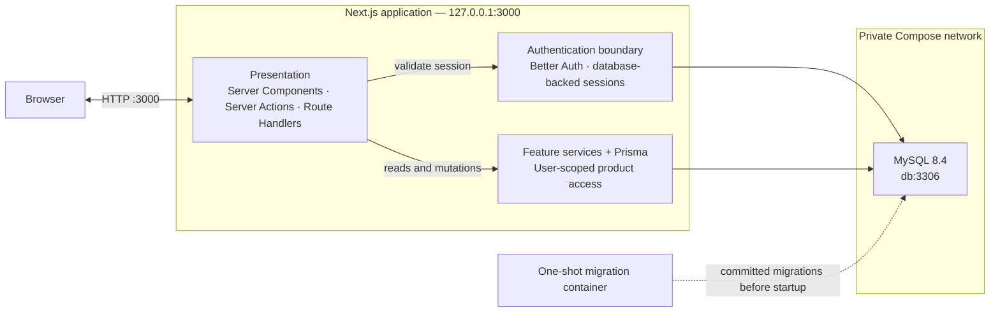

# Architecture

Habit Shaper is one full-stack Next.js application backed by MySQL and run locally through Docker Compose.

## Boundaries

- Compose publishes only the application at `127.0.0.1:3000`. MySQL listens on container port `3306` and has no host-published port.
- Server Components perform reads and Server Actions perform mutations through server-only feature services. Route Handlers are limited to Better Auth and `/api/health`.
- Better Auth stores sessions in MySQL and sends the browser an HTTP-only, same-site session cookie.
- Protected pages and every Server Action validate the server session. The acting User is derived from that session, never from client input.
- Feature services enforce ownership on product reads and mutations. Cross-User resources are treated as not found.
- The migration container applies committed Prisma migrations after MySQL becomes healthy and before the application starts.

Optional seed and test containers are evaluation tooling and are not part of the running application path shown above.

## Implementation sources

- [`compose.yml`](../../compose.yml)
- [`src/lib/auth.ts`](../../src/lib/auth.ts)
- [`src/lib/session.ts`](../../src/lib/session.ts)
- [`src/app/api/auth/[...all]/route.ts`](../../src/app/api/auth/%5B...all%5D/route.ts)
- [`src/app/api/health/route.ts`](../../src/app/api/health/route.ts)
