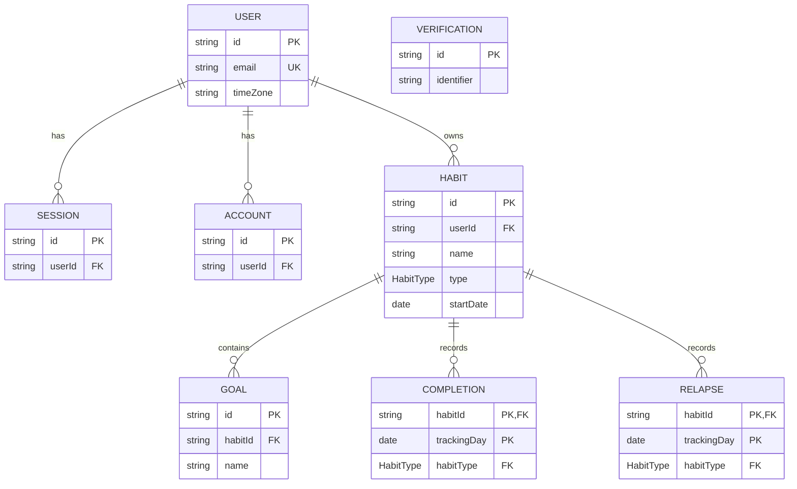

# Data model

Habit Shaper stores Better Auth and product records in the same MySQL database. The diagram shows the primary and foreign keys, essential domain fields, relationships, and cardinalities.

## Key rules

- A User can own zero or many Habits. Each Habit belongs to exactly one User.
- A Habit can contain zero or many Goals. Each Goal belongs to exactly one Habit, so its User ownership is inherited through that Habit.
- A Build Habit can have at most one Completion per Tracking Day; a Break Habit can have at most one Relapse per Tracking Day. The tracking tables use `(habitId, trackingDay)` as their composite primary key.
- Composite foreign keys and database checks ensure Completions reference only Build Habits and Relapses reference only Break Habits.
- Deleting a User cascades to their Sessions, Accounts, Habits, and product records. Deleting a Habit cascades to its Goals and tracking records.
- `startDate` and `trackingDay` are MySQL `DATE` values. They represent calendar dates in the User Time Zone rather than timestamps.
- Better Auth owns User, Session, Account, and Verification persistence. Verification records use an identifier rather than a User foreign key.

## Implementation sources

- [`prisma/schema.prisma`](../../prisma/schema.prisma)
- [`prisma/migrations/20260901000000_initial/migration.sql`](../../prisma/migrations/20260901000000_initial/migration.sql)
